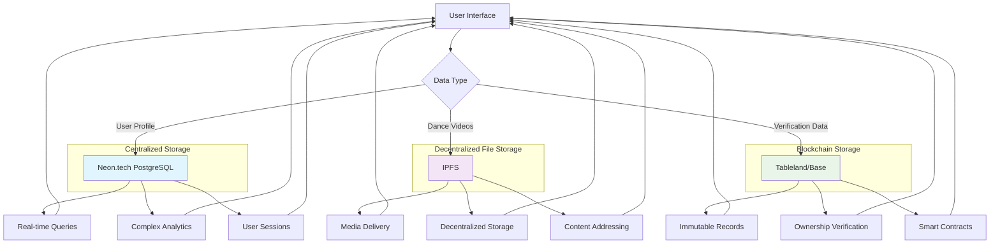

# DegenDancing Data Flow Architecture

This diagram shows how data flows through the different storage systems in the DegenDancing application.

## Data Flow Explanation

### User Profile Creation
1. User submits profile data through the UI
2. Profile stored in Neon.tech for fast access and real-time updates
3. Profile verification record stored on Tableland for immutability
4. Avatar image stored on IPFS for decentralized access

### Dance Chain Creation
1. User creates dance chain through the UI
2. Chain metadata stored in Neon.tech for search and discovery
3. Chain creation record stored on Tableland for provenance
4. Dance move videos stored on IPFS for decentralized access

### Data Retrieval
1. Real-time user interactions served from Neon.tech
2. Media files served from IPFS through CDN
3. Verification data retrieved from Tableland
4. Analytics and reporting from Neon.tech

This hybrid approach ensures optimal performance, cost efficiency, and decentralization principles.